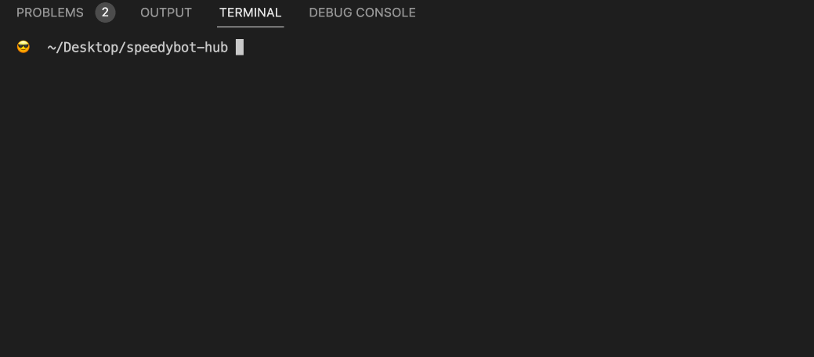
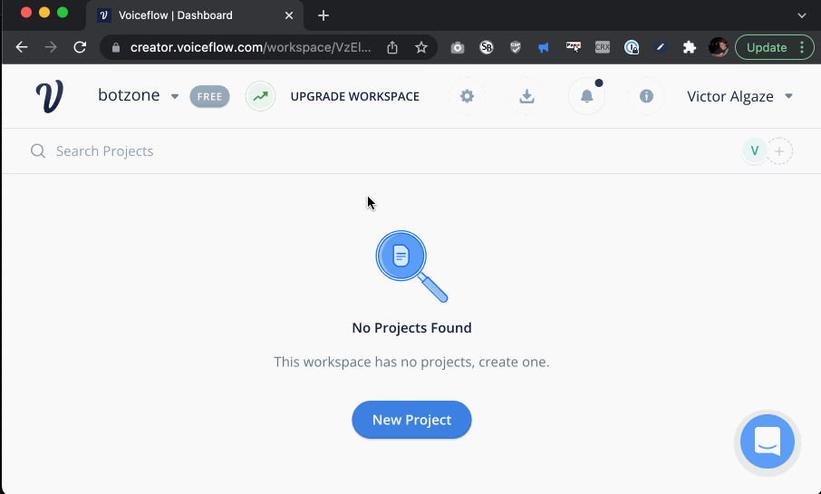
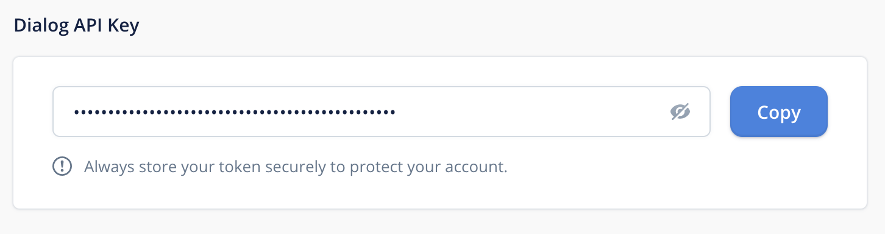
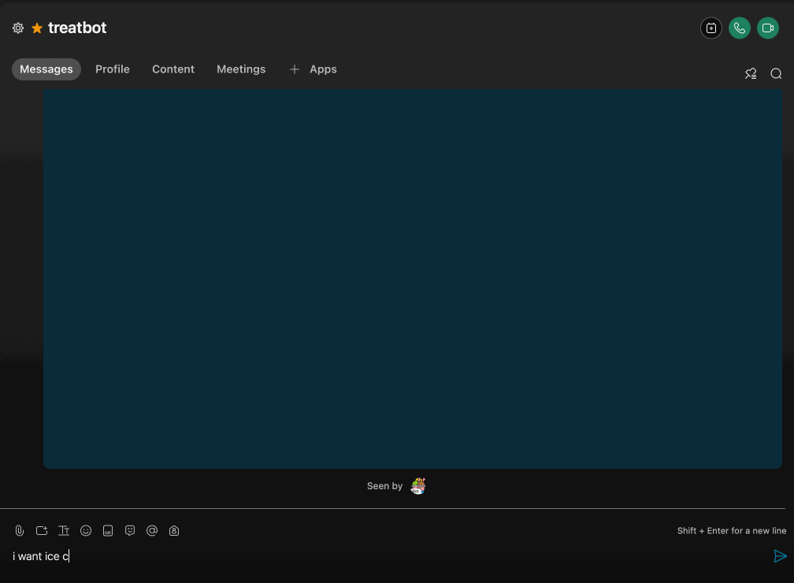
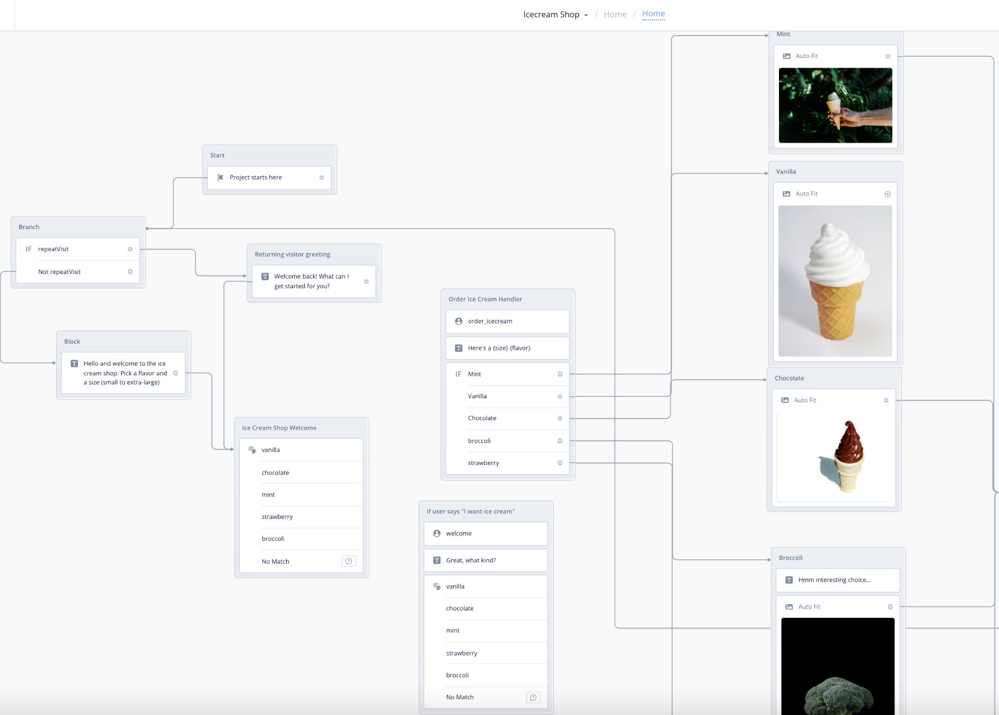
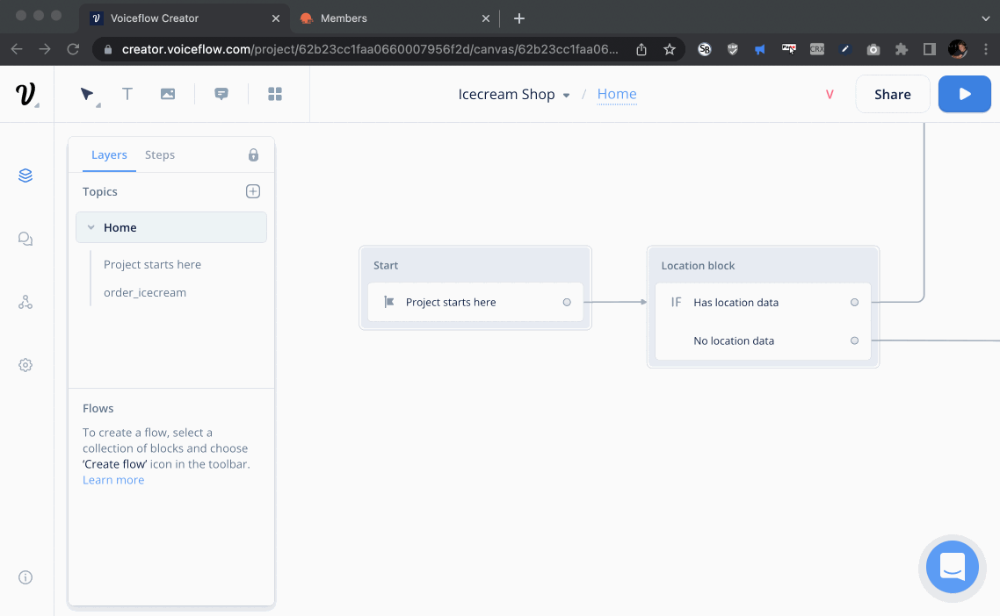

# [QUICKSTART] 🏖 `speedybot hubs` "cloud-native" conversation design infrastructure

Note: The steps below assume you have a working WebEx account & **[Nodejs](https://nodejs.org/en/download/)** 16.7+

## Quickstart

## 1) Clone repo & install dependencies

```
git clone https://github.com/valgaze/treatbot
cd treatbot
npm install
```

## 2) Get your bot URL

- If you don't have one already, get a **[cloudflare account](https://dash.cloudflare.com/sign-up)**

- Authenticate your machine with `npx wrangler login`

- Create a new "worker" from the **[cloudflare dashboard](https://dash.cloudflare.com)** & note its URL (name it https://treatbot.username.workers.dev), you'll need it later

- **NOTE:** Make sure whatever the 1st word in your bot URL is matches the `name` field in **[wrangler.toml](./wrangler.toml)**

## 3) Get your WebEx bot token

- If you don't have a bot, create one and save the token from here: **[https://developer.webex.com/my-apps/new/bot](https://developer.webex.com/my-apps/new/bot)**

- Keep that (sensitive!) token nearby, we'll need it in a minute

## 4. Register your webhooks

With your token + bot url you need to register webhooks (swap out token and your bot URL from the steps 2 & 3 above):

```sh
npm init speedybot webhook create -- -t __your__token__here -w https://treatbot.username.workers.dev
```

Verify all is well with

```sh
npm init speedybot webhook list -- -t __your__token__here
```

## 5.

From the same directory as the repo run the following command to add a secret called `BOT_TOKEN` and enter your info

```sh
npx wrangler secret put BOT_TOKEN
```



## 3) Upload the Voiceflow project

- You can use the **[settings/icecream_shop.vf](./settings/icecream_shop.vf)** file as a starter project

- From your voiceflow dashboard, find the import button in the top right corner and pick a Voiceflow Project, you should see a project that looks something like this



## 4) Voiceflow Canvas api key

- From your project tap the Voiceflow icon in the top right corner select **Project Settings** >> **Integrations**

- Set VoiceFlow api key in **[settings/voiceflow.json](./settings/voiceflow.json)** under the `apiKey` field



## 5) Deploy it!

From the same directory as your repo deploy it with:

```
npm run deploy
```

## 6) Take it for a spin



## Demo

### Project



## Extra credit

### Add weather API key to voiceflow project

- Create an account and get an API key from **https://openweathermap.org/**

- Inside your Voiceflow project, find the useLocationData block and add in the api key


